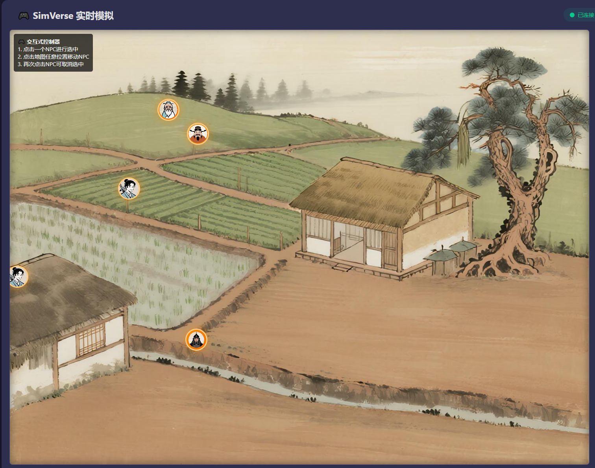
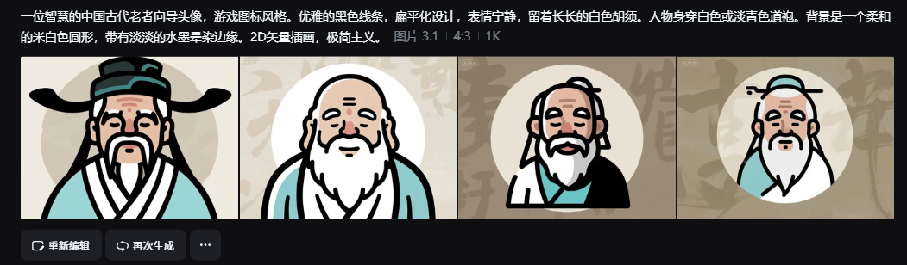

# SimVerse Engine

🎮 一个轻量级的2D实时模拟引擎，支持交互式Web控制器和A*寻路算法。

## 📋 项目概述

SimVerse Engine是一个基于Python FastAPI和JavaScript的实时模拟引擎，具有以下特性：

- 🎯 **A*寻路算法**：智能路径规划，自动绕过障碍物
- 🎮 **交互式Web控制器**：点击NPC选中，再点击目标位置即可移动
- 📡 **实时通信**：WebSocket实现前后端实时数据同步
- 🛤️ **精确碰撞检测**：基于网格的障碍物系统
- 🔄 **状态管理**：完整的NPC状态管理和超时恢复机制
- 🎨 **美观界面**：现代化的UI设计和流畅的动画效果

### 🖼️ 项目效果预览



## 🏗️ 系统架构

```
SimVerse-Engine/
├── backend/           # Python FastAPI后端
│   └── main.py       # 主服务器文件
├── frontend/          # 前端Web界面
│   ├── index.html    # 交互式控制器
│   ├── test_interactive.html  # 测试页面
│   └── debug.html    # 调试页面
├── controller/        # 模拟控制器
│   └── controller.py # 控制器脚本
├── assets/           # 游戏资源
│   ├── game-map.png  # 游戏地图
│   └── map_with_grid.png # 带网格的施工图
├── OBSTACLE_DEFINITION.md # 障碍物定义文档
├── SYSTEM_VALIDATION.md  # 系统验证报告
└── requirements.txt  # Python依赖
```

## 🚀 快速开始

### 环境要求

- Python 3.8+
- 现代浏览器（Chrome、Firefox、Safari、Edge）

### 安装步骤

1. **克隆项目**
   ```bash
   git clone <repository-url>
   cd SimVerse-Engine
   ```

2. **创建虚拟环境**
   ```bash
   python -m venv .venv
   ```

3. **激活虚拟环境**
   - Windows:
     ```bash
     .venv\Scripts\activate
     ```
   - macOS/Linux:
     ```bash
     source .venv/bin/activate
     ```

4. **安装依赖**
   ```bash
   pip install -r requirements.txt
   ```

### 运行系统

1. **启动后端服务器**
   ```bash
   uvicorn backend.main:app --reload
   ```
   
   服务器将在 `http://localhost:8000` 启动

2. **打开前端界面**
   
   在浏览器中打开 `frontend/index.html` 文件

3. **（可选）启动模拟控制器**
   ```bash
   python controller/controller.py
   ```

## 🎮 使用指南

### 基本操作

1. **选择NPC**
   - 点击地图上的任意NPC进行选中
   - 选中的NPC会有发光效果和放大动画

2. **移动NPC**
   - 选中NPC后，点击地图上的任意目标位置
   - NPC会自动寻路并移动到目标位置

3. **取消选中**
   - 再次点击已选中的NPC可以取消选中

### 界面说明

- **连接状态指示器**：显示与后端的连接状态
- **操作提示**：左上角显示操作说明
- **NPC状态**：不同颜色表示不同类型的NPC
  - 🔵 玩家（蓝色）
  - 🔴 守卫（红色）
  - 🟠 NPC（橙色）

### 键盘快捷键

目前暂无键盘快捷键，所有操作通过鼠标点击完成。

## 🛠️ 开发指南

### 后端开发

#### 主要模块

- **FastAPI应用**：处理HTTP请求和WebSocket连接
- **A*寻路算法**：基于网格的智能路径规划
- **状态管理**：NPC状态跟踪和超时恢复
- **连接管理**：WebSocket连接的建立和维护

#### API端点

- `GET /` - 系统状态页面
- `GET /docs` - Swagger API文档
- `GET /redoc` - ReDoc API文档
- `POST /command/move/{npc_id}` - 传统移动指令
- `POST /command/interactive_move` - 交互式移动指令
- `GET /admin/npc_states` - NPC状态查询
- `POST /admin/reset_npc_state/{npc_id}` - 重置NPC状态
- `WebSocket /ws` - 实时数据连接

#### WebSocket消息格式

```javascript
// 连接建立
{
  "action": "connection_established",
  "client_id": "client_1_1234567890",
  "message": "成功连接到SimVerse Engine",
  "game_state": { ... }
}

// 移动指令
{
  "action": "move_along_path",
  "data": {
    "npc_id": "npc_1",
    "path": [
      {"x": 150, "y": 250},
      {"x": 200, "y": 300},
      ...
    ]
  }
}

// 状态更新
{
  "action": "state_update",
  "data": { ... }
}
```

### 前端开发

#### 核心功能

- **交互式控制器**：点击选择和移动NPC
- **实时渲染**：WebSocket驱动的实时状态更新
- **动画系统**：流畅的NPC移动动画
- **错误处理**：完善的错误提示和恢复机制

#### 文件结构

```
frontend/
├── index.html           # 主界面
├── test_interactive.html # 功能测试页面
└── debug.html          # 调试工具页面
```

#### 自定义地图

1. 准备地图图片（PNG格式）
2. 创建带网格的施工图（32x32像素每格）
3. 在`backend/main.py`中更新障碍物定义
4. 调整地图尺寸和网格参数

### AI资源生成

为了帮助开发者快速创建高质量的游戏资源，我们提供了经过验证的AI文生图提示词。这些提示词可以直接用于Midjourney、Stable Diffusion等AI绘画工具，生成风格统一的游戏素材。

#### 🧙‍♂️ 向导角色提示词



#### ⚔️ 侠客角色提示词


#### 🛡️ 士兵角色提示词


#### 🏪 商人角色提示词


#### 🏞️ 游戏背景提示词


**使用建议：**
- 直接复制提示词到AI绘画工具中
- 可以根据需要调整细节描述
- 建议保持风格一致性，便于游戏整体视觉效果统一

## 🧪 测试

### 自动化测试

使用测试页面验证功能：

```bash
# 打开测试页面
frontend/test_interactive.html

# 打开调试页面
frontend/debug.html
```

### 手动测试

1. **连接测试**：打开前端页面，检查连接状态
2. **移动测试**：选择NPC并移动到不同位置
3. **边界测试**：测试移动到地图边界和障碍物附近
4. **并发测试**：同时移动多个NPC

## 🐛 故障排除

### 常见问题

1. **前端显示"发送移动指令失败"**
   - 确保后端服务器正在运行
   - 检查浏览器控制台是否有错误信息
   - 验证防火墙设置

2. **NPC无法移动到目标位置**
   - 检查目标位置是否为障碍物
   - 确认NPC处于idle状态
   - 查看后端日志中的寻路信息

3. **WebSocket连接断开**
   - 检查后端服务器是否正常运行
   - 确认网络连接正常
   - 查看浏览器控制台的错误信息

### 调试工具

- **浏览器开发者工具**：查看网络请求和控制台日志
- **后端日志**：查看服务器运行状态和错误信息
- **调试页面**：`frontend/debug.html` 提供详细的测试功能

### 日志查看

```bash
# 查看后端日志（控制台输出）
uvicorn backend.main:app --reload

# 查看前端日志（浏览器开发者工具）
# 在浏览器中按 F12，选择 Console 标签
```

## 📊 性能优化

### 已实现的优化

- **连接管理**：自动清理断开的WebSocket连接
- **状态缓存**：避免重复的状态同步
- **路径优化**：A*算法的高效实现
- **动画优化**：基于requestAnimationFrame的流畅动画

### 性能建议

- 定期清理NPC状态，避免状态泄漏
- 合理设置移动超时时间
- 监控内存使用情况
- 优化障碍物定义的精度

## 🤝 贡献指南

### 开发流程

1. Fork项目
2. 创建功能分支
3. 提交代码更改
4. 创建Pull Request
5. 代码审查和合并

### 代码规范

- Python代码遵循PEP 8规范
- JavaScript代码使用ES6+语法
- 所有注释使用中文
- 提交信息使用英文

### 提交规范

```
feat: 新功能
fix: 修复bug
docs: 文档更新
style: 代码格式化
refactor: 重构
test: 测试相关
chore: 构建或辅助工具变动
```

## 📄 许可证

本项目采用 MIT 许可证。详情请参阅 [LICENSE](LICENSE) 文件。

## 🙏 致谢

感谢所有为SimVerse Engine项目做出贡献的开发者！


---

**SimVerse Engine** - 让2D实时模拟变得简单而有趣！🎮✨
